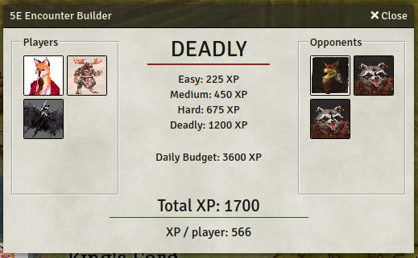
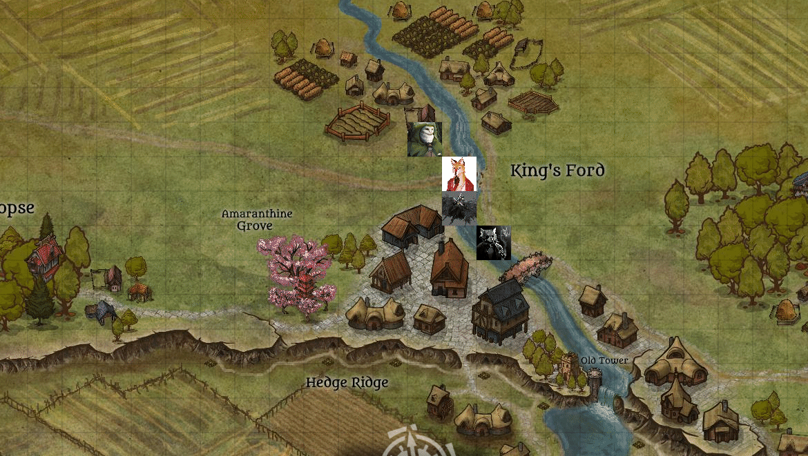

## 5E Encounter Builder

* **Author**: RaySSharma#4736
* **Version**: 0.4.0
* **Foundry VTT Compatibility**: 10+
* **System Compatibility (If applicable)**: D&D5E
* **Translation Support**: en

### Link(s) to Module

* [https://github.com/RaySSharma/foundry-modules/tree/master/encounter-builder](https://github.com/RaySSharma/foundry-modules/tree/master/encounter-builder)
* [https://raw.githubusercontent.com/RaySSharma/foundry-modules/master/encounter-builder/encounter-builder/module.json](https://raw.githubusercontent.com/RaySSharma/foundry-modules/master/encounter-builder/encounter-builder/module.json)

### Description

This module adds an Application to aid in building D&D5E combat encounters. Following a similar design to [Kobold Fight Club](https://kobold.club/fight/#/encounter-builder), this module calculates encounter difficulty for your chosen PCs and monsters/NPCs. Encounter prep has never been easier!

* Calculates combat difficulty based on XP thresholds (DMG) for players
* Includes difficulty multipliers for fights against many opponents
* Adjusts difficulty for parties of <3 players, or >5 players.
* Calculates total XP and XP per player.
* Drag-and-drop from compendiums or existing actors.
* Drag-and-drop from builder to canvas.
* *Approximates* encounter difficulty for friendly monsters or hostile players
  * Hostile player XP set by comparing level to the deadly XP threshold table.
  * Allied monster levels set by comparing XP to the deadly XP threshold table.

### Installation

#### Method 1

* Download the .zip file in this repository.
* Extract the contents of the zip to your dataPath, `/Data/modules/`
* Restart Foundry.

#### Method 2

* Start up Foundry and click "Install Module" in the "Add-On Modules" tab.
* Paste the link: `https://raw.githubusercontent.com/RaySSharma/foundry-modules/master/encounter-builder/encounter-builder/module.json`
* Click "Install" and it should appear in your modules list.

### Updates

#### 0.0.1

* Created the Encounter Builder Application.

#### 0.0.2

* Fixed call to the Application parent class (thanks @tposney#1462).

#### 0.1.0

* Added drag-and-drop for actors from builder to canvas.
* Added drag-and-drop for actors in compendiums to builder.
* Changed to click-to-remove for actors in builder.
* Added on-hover image for actors in builder.
* Added Chrome support (event.explicitOriginalTarget -> event.srcElement).

#### 0.2.0

* Added support for hostile (opponent) players or friendly (allied) monsters.
* Player characters can only be placed once. Monsters can be placed multiple times.
* Added box highlighting when dragging opponents.
* Refactored HTML and CSS.
* Added button to clear builder.

#### 0.3.0

* Updated for Foundry VTT V9+ (thanks @dmizrahi)

#### 0.4.1

* Updated for Foundry VTT V10 (thanks stian-svedenborg)
* Fixed bugs with drag-to-canvas